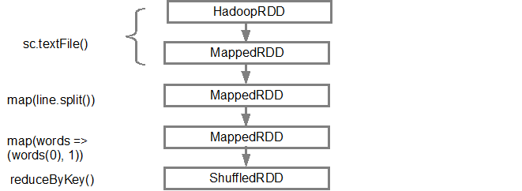
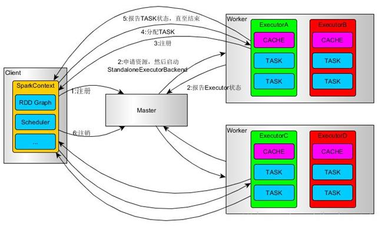
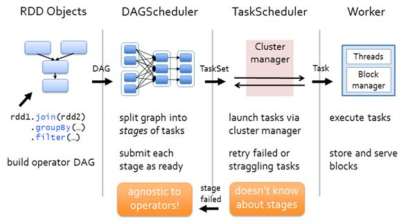
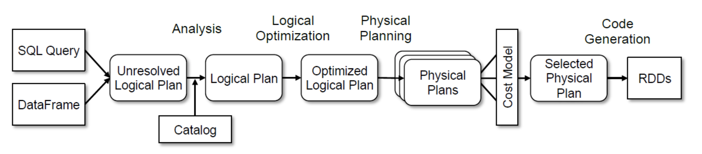
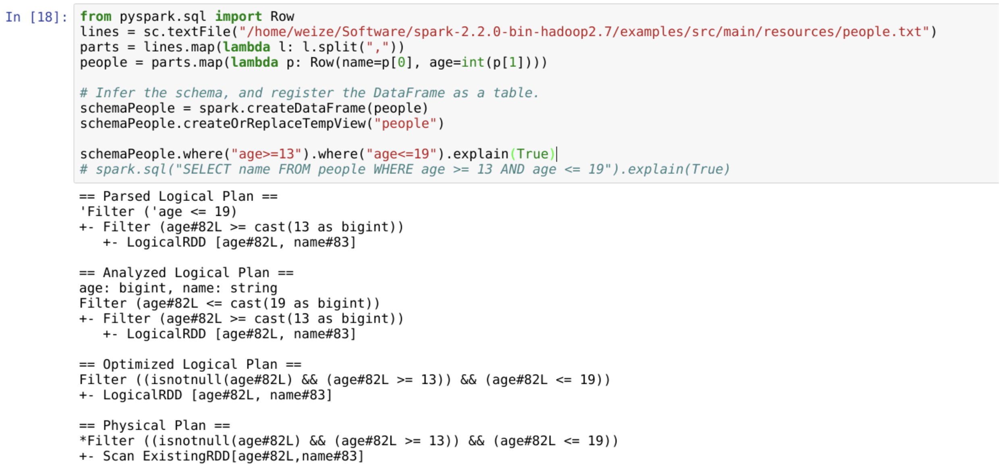
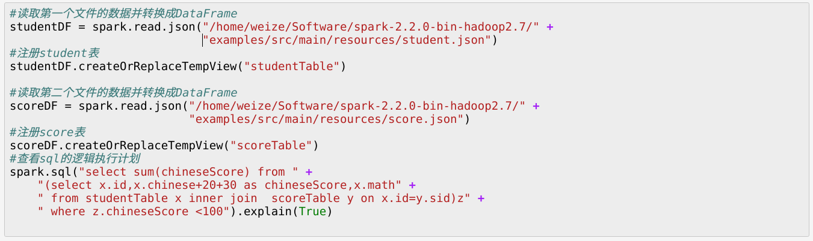

架构图：

1. 基本数据和计算模型
RDD和DAG
RDD（resilient distributed dataset）
最根本的，RDD是一个数据集合，支持一系列操作进行数据处理变换。
举个例子：
现在有一个日志文件（输入）：
INFO I'm Info message
WARN I'm a Warn message
INFO I'm another Info message
需要统计INFO级别的日志和WARN级别的日志分别有多少（输出）。

那么我们如果直接写如下一个程序即可完成统计：
line = readline()
words = line.split()
if (words[0] == "INFO") {
     iCount ++;     
} else if (words[0] == "WARN") {
     wCount ++;
}
return {"INFO": iCount, "WARN": wCount}

那么，基于spark写出来是怎样的呢：
1. val input = sc.textFile("log.txt")
2. val counts = input.map(line => line.split(" "))
3.                   .map(words => (words(0), 1))
4.                   .reduceByKey{(a,b) => a + b}
流程：
1. 通过sparkContext的textFile方法生成一个数据集合（RDD）
2. 对这个数据集合中的每行数据按空格进行拆分
3. 取每行第一个单词作为key，并赋值1
4. 最后根据key进行合并，从而统计出最后的结果。

如果从RDD的视角来看，就是：

每一步都会产生一个新的RDD，作为下一步处理的输入数据集合。

除了“数据集合、变换”这两个最基本的定义外，RDD有一系列的特性，可以理解为是专门为并行计算或者解决并行计算带来的副作用而设计的。
（1）它被分为多个分区，每个分区分布在集群中的不同节点上，从而让RDD中的数据可以被并行操作。（分布式数据集）
（2）容错性，可以自动从节点失败中恢复。即如果某个节点上的RDD partition，因为节点故障，导致数据丢了，那么RDD会自动通过自己的数据来源重新计算该partition。（这个过程对使用者透明）
这里spark用到了一个“血缘”的概念来进行RDD变换的回放，即，每个RDD都可以追溯到它的源头及变换过程。
 (3) RDD的数据默认情况下存放在内存中的，但是在内存资源不足时，Spark会自动将RDD数据写入磁盘。(提升性能)
我们还可以手动调用RDD的cache功能来多次复用或者加速回放。
(4) RDD只读，每次操作会产生新的RDD。（原因我暂时还没有理解）

有了这些特性，我们可以做什么样的优化呢？ RDD拆分成多个分区，分到多台机器上去执行。

                                          |
                                          |
                                         \/

到了这里，我们可以看到：
（1）计算过程是一个有向无环图（DAG）
（2）有的时候需要分阶段去执行，每个阶段必须完全结束才能开始下一阶段

DAG
DAG在spark里用来表示RDD变换的拓扑结构，它可以表示比较复杂的计算逻辑，如下图：
（下图我们可以想象为：多个异构数据集合在分别经过一系列转换后最后join到一起，并继续后续处理）

Stage
为什么DAG中的操作需要分阶段呢？
因为有些操作需要等它上一步的操作的所有分区全部完成才能继续进行，因此在上一步（stage[n-1]）完成之前，下一步（stage[n]）就不能开始。
以我们第一个程序为例，
每个分区的map(line => line.split(" "))操作是不依赖于其他分区的，他只需要把本分区内的每一行按照空格分好即可；
但是对于reduceByKey来说，需要用到上一步map的所有分区的结果，因为在上一步map的过程中，分区中的数据是乱序的。
.map(words => (words(0), 1))
.reduceByKey{(a,b) => a + b}

事实上，对于RDD支持的所有操作算子中，需要分为“需要所有分区”和“只需要一个分区”两种类型，官方说法叫宽依赖和窄依赖的算子。
窄依赖表现为一个父RDD的分区对应于一个子RDD的分区，或者多个父RDD的分区对应一个子RDD的分区。（map, filter,union……）
宽依赖表现为一个父类的RDD的一个分区对应一个子RDD的多个分区。（reduceByKey, sortByKey, groupBy……）

所以，每当DAG中出现宽依赖时，就需要在这里进行阶段的划分。
参考：https://spark-internals.books.yourtion.com/markdown/4-shuffleDetails.html
从任务调度的层面来看
Saprk提供了job, stage 和 task 三层概念抽象
（1）task - Spark中最小的任务执行单元，每个tranformation操作，都会被翻译成相应的task，由executor应用到相应的RDD上。
（2）stage - 一组由narrow transformation构成的task，被合并成一个stage，由于不需要在节点间传输数据，stage可以被高效执行。
（3）job - 每一个action在实际执行时，对应着一个job，一个job可以包含多个stage。

http://litaotao.github.io/deep-into-spark-exection-model

调度整体流程：

看到这里，我们发现，基于RDD实现的Spark相比于传统的Hadoop MapReduce有什么优势呢？
总结起来应该至少有三点：
1）RDD提供了丰富的操作算子，不再是只有map和reduce两个操作了，对于描述应用程序来说更加方便；
2）通过RDDs之间的转换构建DAG，中间结果不用落地；
3）RDD支持缓存，可以在内存中快速完成计算。
性能优化的一些参考：https://my.oschina.net/bigsloth/blog/754787

2. DataFrame对象（最新的spark版本可能叫DataSet，但是原理基本一样）
DataFrame是一个以RDD为基础的，但却是一种类似二维数据表的一种分布式数据集。与RDD不同的是，前者带有schema元信息，即DataFrame所表示的二维表数据集的每一列都带有名称和类型。
例如对于一个文件

{"name":"Michael"}
{"name":"Andy", "age":30}
{"name":"Justin", "age":19}
的执行流程是怎样的呢。
普适的SQL执用以下方法将该文件转化为DataFrame并将其内容打印出来，可以看到类似于数据表的结构了。
val dataFrame = spark.read.json("examples/src/main/resources/people.json")
// Displays the content of the DataFrame to stdout
dataFrame.show()
// +----+-------+
// | age|   name|
// +----+-------+
// |null|Michael|
// |  30|   Andy|
// |  19| Justin|
// +----+-------+
进一步的，可以将其注册为具体的数据表并执行sql查询
dataFrame.registerTempTable("people")
dataFrame2 = spark.sql("select * from people where age>20")
dataFrame2.show()
schema信息有两种获取方式：
1. 直接通过类得到：
val sqlContext = new org.apache.spark.sql.SQLContext(sc)
import sqlContext.implicits._

case class Person(name: String, age: Int)
val people = sc.textFile("examples/src/main/resources/people.txt").map(_.split(",")).map(p => Person(p(0), p(1).trim.toInt)).toDF()
spark引擎会直接根据Person类的字段定义决定people这个DataFrame的schema。
2. 显式定义：
val sqlContext = new org.apache.spark.sql.SQLContext(sc)
import org.apache.spark.sql.Row;
import org.apache.spark.sql.types.{StructType,StructField,StringType};

val schema =
  StructType(
    "name age".split(" ").map(fieldName => StructField(fieldName, StringType, true)))

val rowRDD = people.map(_.split(",")).map(p => Row(p(0), p(1).trim))

val peopleDataFrame = sqlContext.createDataFrame(rowRDD, schema)

那么，SparkSQL其背后的执行流程是怎样的呢。
普适的SQL执行流程一般是：
解析SQL语法树
制定逻辑计划
生成物理计划
执行物理计划
spark的sql执行流程同样有类似的几个步骤，

6
不管是DF还是SQL查询语句，经过Parser，都会变成逻辑执行计划Logical Plan，而Catalyst则会针对这个逻辑计划进行优化。
Catalyst对Unresolved Logical Plan进行分析，与注册DF时声明的Schema进行对比，如果发现不一致（比如你列名打错了），那么就会在这一阶段跳出，并给出相应的异常提示。如果通过了分析，那么就成功晋升为Logical Plan
之后逻辑优化器Logical Optimization就要开始干活了，它会遍历整个Plan，并对当前的Plan应用第一种优化方法“Rules”，这些Rules是预先设定好的一些优化规则，例如对常数的合并或是对执行顺序进行调整。应用这些规则后的Plan虽然已经不是原来的模样，但是通过它执行并运算出的结果一定是和无优化的版本直接执行后的结果等价的，这也是优化器的原则之一：保证程序正确性的前提下，尽可能地提高程序的性能。
物理计划阶段，Catalyst会根据优化好的逻辑执行计划生成N种物理执行计划Physical Plans，所谓物理计划，也就是和最终的Spark计算框三种数据集合及相应的API架的语义能够相互对应（你基本可以理解Spark计算框架的语义就是RDDs API）。当然，条条大路通罗马，这也是为何在这一阶段Catalyst要生成N份物理计划的原因。当然生成了之后也不能不管他们，我们必须要选择一种方案作为最终的执行方案，那么这个时候就会启用第二种优化方法“Cost”，顾名思义，就是通过计算预估各个方案的开销，然后选择开销最小的一个方案最为最终的物理计划。
最终的物理计划经过代码生成阶段就变成了RDDs（表现形式为可以被执行的代码），通常来讲，可能需要做一套专用的编译器来把这些执行计划编译为可以塞进JVM的Java bytecode，不过Spark团队为了简化这一阶段的开发，启用了一项名为“Quasiquotes”的Scala语言特色技术，让技术人员可以通过简单的拼字符串的方式拼出可执行程序（看上去有点像JavaScript的eval()函数，不过我觉得更像C#语言当中的“表达式树”，只不过功能更全，使用更简便）。通过代码生成，SQL/DF的语义最终被转换为了RDDs，而RDDs将会被Spark的执行引擎接收并计算。

sql执行的各个阶段图示。

参考：http://blueve.me/archives/1472

稍微总结一下Catalyst的优化方法：
（1）对逻辑执行计划应用“Rule”优化
（2）随后对物理执行计划应用“Cost”优化，最后把物理执行计划生成为RDDs。

（1）rule优化举例：
schemaPeople.where("age>=13").where("age<=19").explain(True)
分析出来的语法树结构：

== Analyzed Logical Plan ==
age: bigint, name: string
Filter (age#82L <= cast(19 as bigint))
+- Filter (age#82L >= cast(13 as bigint))
   +- LogicalRDD [age#82L, name#83]
经过“多次filter可以合并成一次filter”这条rule之后，就可以优化成：

== Optimized Logical Plan ==
Filter ((isnotnull(age#82L) && (age#82L >= 13)) && (age#82L <= 19))
+- LogicalRDD [age#82L, name#83]
（2）Cost优化：（暂时没有深入）
（3）扩展数据源优化：
假设我们需要混入来自于MySQL数据库的数据，于是我们写下了下面这样的Spark SQL语句：
SELECT * FROM MYSQL_TABLE WHERE id > 100

== Physical Plan ==
WholeStageCodegen
:  +- Filter (id#2 > 90)
:     +- INPUT
+- Scan ExistingRDD

如果MySQL数据表中的数据量非常巨大，在现有的这个执行逻辑下，就会导致MySQL先将该数据表的所有数据导出给Spark SQL，然后再由Spark SQL执行Filter操作，而导出数据表的所有数据的代价是非常高的（相当于多了很多额外的数据传输），我们可以采取的做法是：由MySQL先执行过滤操作，Spark SQL直接接收过滤后的数据即可。
     Spark SQL会针对这一情况进行优化，把一部分工作交给数据源适配器去做：
2
这一点在我们对接外部数据源的时候尤其需要注意。

看一个稍微复杂点的例子,更加深入的了解一下各个阶段具体干的事情：

SQL:
select sum(chineseScore) from
(select x.id,x.chinese+20+30 as chineseScore,x.math
from studentTable x inner join scoreTable y on x.id=y.sid) z
where z.chineseScore <100
语法树解析、优化过程: 

Spark SQL支持的数据源
datasource api

三种数据集合及相应的API
RDD、Dataset、DataFrame
http://www.bihell.com/2017/01/05/a-tale-of-three-apache-spark-apis-rdds-dataframes-and-datasets/

spark streaming部分

流式的概念是说数据源是实时的，在线的，和批处理的一个最主要的区别在于边界未定。
Spark Streaming
在spark streaming中，数据集合对象是DStream，可以理解为，一个DStream是由多个RDD顺序组成。
Spark Streaming
# Create a local StreamingContext with two working thread and batch interval of 1 second
sc = SparkContext("local[2]", "NetworkWordCount")
ssc = StreamingContext(sc, 1)
# Create a DStream that will connect to hostname:port, like localhost:9999
lines = ssc.socketTextStream("localhost", 9999)
# Split each line into words
words = lines.flatMap(lambda line: line.split(" "))
# Count each word in each batch
pairs = words.map(lambda word: (word, 1))
wordCounts = pairs.reduceByKey(lambda x, y: x + y)
# Print the first ten elements of each RDD generated in this DStream to the console
wordCounts.pprint()
ssc.start()

#ssc.stop() 

Spark Streaming

Spark Streaming
当然除此以外，Streaming中还有一个很重要的概念叫Window，即，把批序列按照一定的区间进行切分（例如每五分钟一个窗口），然后在每个切分的窗口上做一系列的算子操作。不同的window可以部分重叠。
如图：
Spark Streaming
算子还是很类似的，只是多了个window作为范围约束。
# Reduce last 30 seconds of data, every 10 seconds
windowedWordCounts = pairs.reduceByKeyAndWindow(lambda x, y: x + y, lambda x, y: x - y, 30, 10)
这个功能在很多场景下非常有用，例如我们经常需要每五分钟统计一次cpu平均使用率。

stream可以互相join：
stream1 = ...
stream2 = ...
joinedStream = stream1.join(stream2)

windowed stream的join：
windowedStream1 = stream1.window(20)
windowedStream2 = stream2.window(60)
joinedStream = windowedStream1.join(windowedStream2)

stream和RDD join：
dataset = ... # some RDD
windowedStream = stream.window(20)
joinedStream = windowedStream.transform(lambda rdd: rdd.join(dataset))

stream的sql查询：

# DataFrame operations inside your streaming program

words = ... # DStream of strings

def process(time, rdd):
    print("========= %s =========" % str(time))
    try:
        # Get the singleton instance of SparkSession
        spark = getSparkSessionInstance(rdd.context.getConf())

        # Convert RDD[String] to RDD[Row] to DataFrame
        rowRdd = rdd.map(lambda w: Row(word=w))
        wordsDataFrame = spark.createDataFrame(rowRdd)
    
        # Creates a temporary view using the DataFrame
        wordsDataFrame.createOrReplaceTempView("words")
    
        # Do word count on table using SQL and print it
        wordCountsDataFrame = spark.sql("select word, count(*) as total from words group by word")
        wordCountsDataFrame.show()
    except:
        pass

words.foreachRDD(process)

一个使用场景示例：
https://docs.cloud.databricks.com/docs/latest/databricks_guide/07%20Spark%20Streaming/13%20Joining%20DStreams.html

structured streaming：（https://spark.apache.org/docs/latest/structured-streaming-programming-guide.html）

先简单看一下例子熟悉一下编程模型：
http://www.jianshu.com/p/2673a6e4254f

简单理解，其实就是把DataFrame用在流里，并且根据流与batch的区别做一些调整。
认为stream就是一个没有边界的数据表，而window内的数据就是一段时间内的表数据。
Stream as a Table

全量聚合：
Model
window聚合：
Window Operations

需要注意的一些点：
（1）数据过期(水印watermark的用法)；
（2）有一些限制（参见：https://spark.apache.org/docs/latest/structured-streaming-programming-guide.html#unsupported-operations）
例如：多个dataframe stream的join，top n，distinct……
（3）数据去重、故障恢复。
其他特性：
（1）可以在stream中调用MLlib的功能（基于DataFrame或者RDD，推荐前者）
（2）缓存（减少重复计算；ocs自动，可调优）
（3）检查点 checkpoint

RDD、Dataset、DataFrame
http://www.bihell.com/2017/01/05/a-tale-of-three-apache-spark-apis-rdds-dataframes-and-datasets/

MLlib
可以基于RDD或者DF做，推荐用DF；
提供的功能有：分类回归（svm、线性回归、logistic回归、朴素贝叶斯、决策树……）、协同过滤推荐、聚类（k-means、LDA、混合高斯模型）、特征提取、关联匹配（Pearson、FP）、降维、优化（ Gradient descent, SGD，BFGS……）
（没有仔细研究，粗浅理解：DF作为通用计算api来做一些ml模型；好处：利用spark的并行和内存使用能力）

