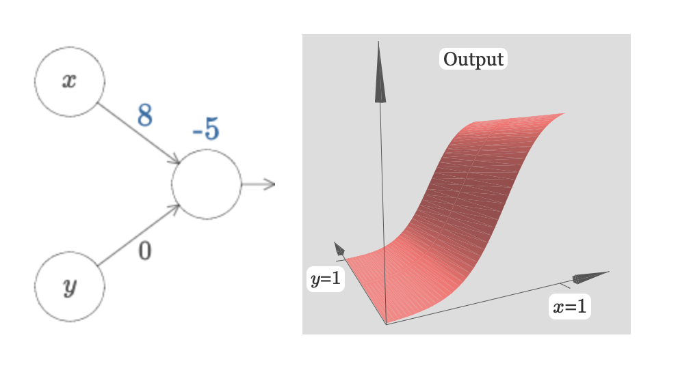
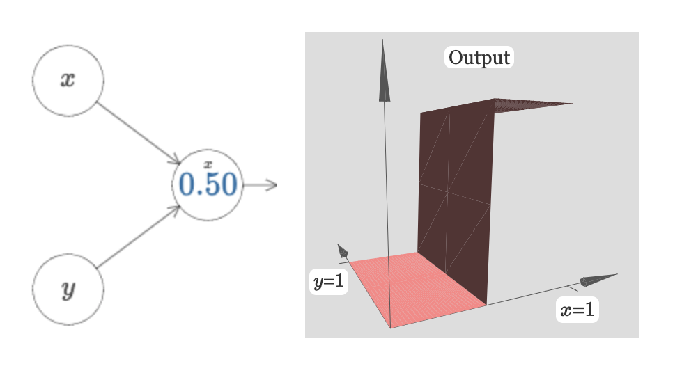
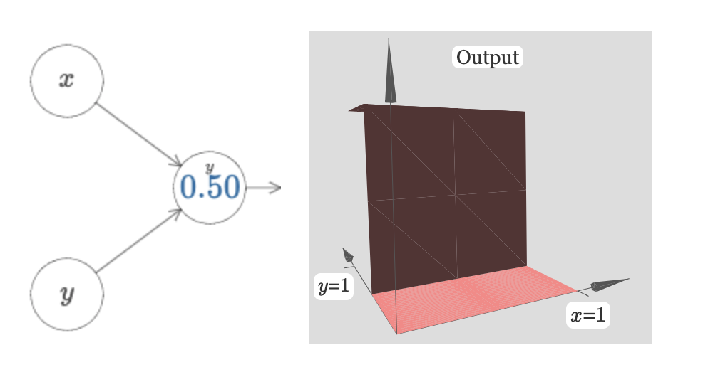
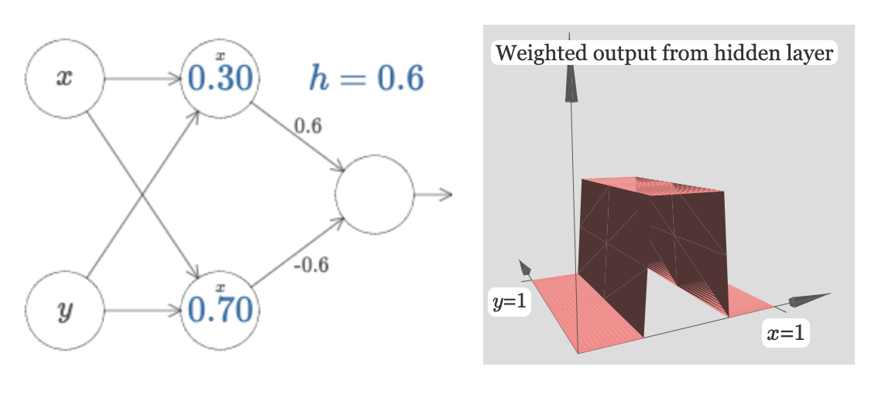
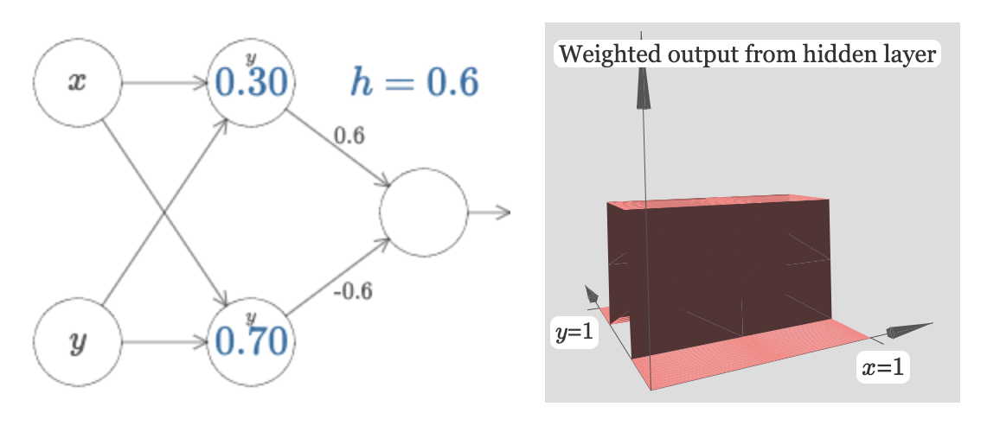
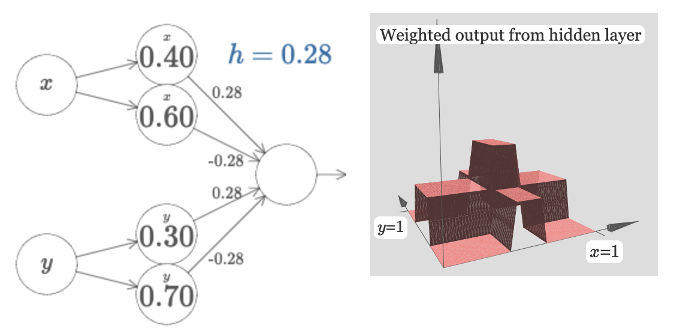
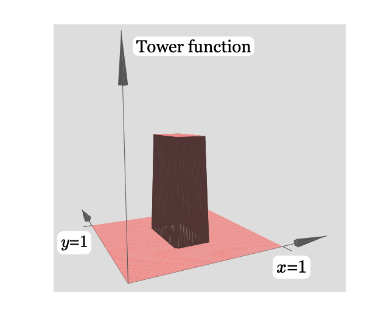
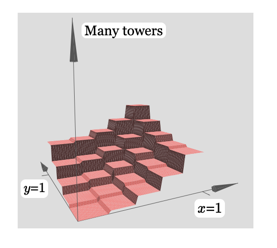
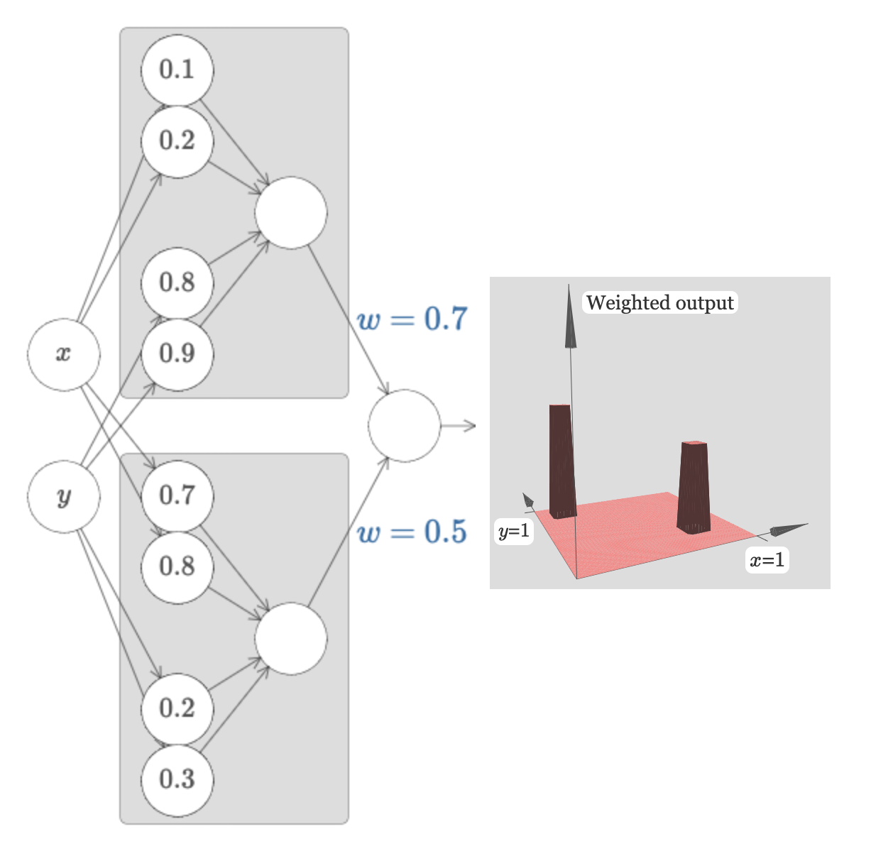
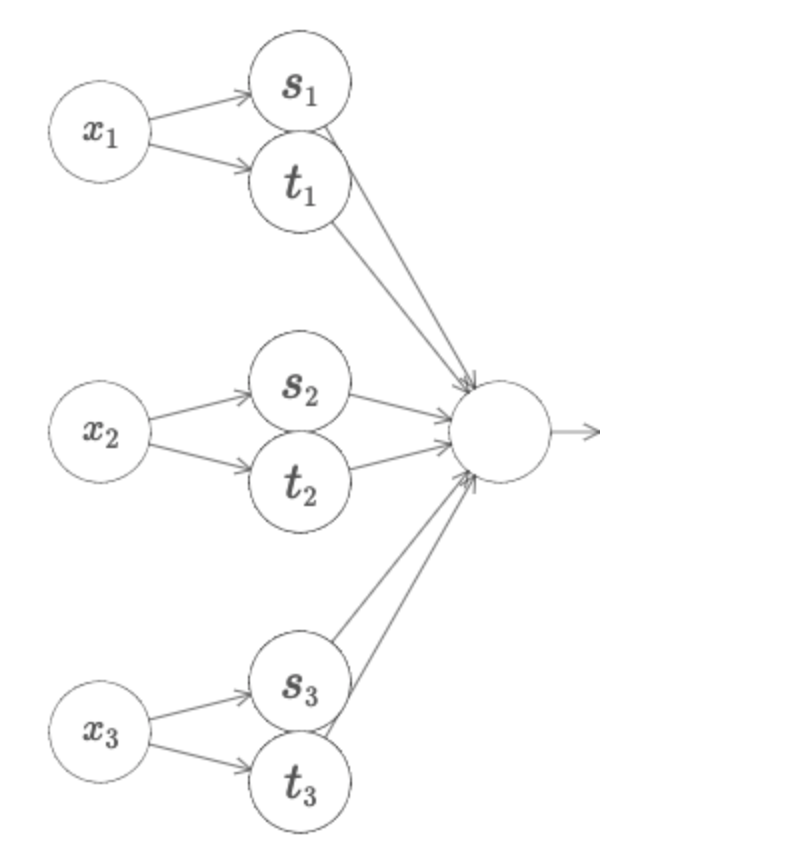

神经网络为什么有这么强大的能力呢，原因是因为**它能以任意的精度拟合任何函数**。

接下来我们通过一系列不那么严谨但是很直观的例子来说明这个问题。

#### 输入输出均为一元变量的函数

神经网络能表达任意的一元函数 y=f(x)。

先看一个最简单的神经网络部件,把下方神经元的w和b都设为0，它的图形如下图所示：

接下来，修改一下b的值，发现图形只是沿着x轴发生了平移：

而改变w的值，影响的是曲线的陡峭程度，越大越陡峭，越小越平坦

如果我们把w写成一个很大的值，发现函数图像接近于一个阶跃函数：

于是，我们只用一个参数s，表示阶跃的位置。

如果我们在0.4位置设置一个高度0.8的阶跃，在0.6位置设置一个高度-0.8的阶跃，函数图形就变成了：在0.4到0.6的位置产生了一个高度0.8的脉冲：

那我们索性再用一个参数h代替原来的(w1,w2), 表示这个脉冲的高度：

如果我们在中间层添加更多的节点，我们可以在定义域不同区间上制造连续的高度不一的脉冲，如果我们增加越来越多的中间节点，把脉冲的区间进一步缩小，就可以任意精度去贴近函数曲线了。

通过以上例子，我们说明了为什么**给定足够多的中间神经元**，神经网络可以以任意精度拟合任意一元函数。

#### 二元函数的情况

首先看一个输入有两个变量的函数的形状，其中，我们固定了y值对应的权重，将其设为0.

和一元函数的情况类似，我们把x对应的权重w设得很大，例如999，就可以获得一个近似于在x轴某个位置突变的阶跃函数；然后调整b的值，就可以控制阶跃的位置。

同样，我们可以控制函数在y轴的某个位置阶跃。

我们可以进一步地，制造一个台阶，图中的参数0.3、0.7对应着台阶的起始位置，h=0.6对应着台阶的高度。

同样，我们可以制造沿着y轴展开的台阶。

让我们把它们叠起来，就变成一个在[0.3<=x<=0.7, 0.3<=y<=0.7]这片区域内高度比其他台阶地区高一倍的“塔”。

那么，如果我们能造下图这样的一个真正的塔，是不是我们就能用一片塔撑起一个函数了呢？

例如，用一片塔凑在一起：

实际上，我们只要在输出之前，再增加一个一元的阶跃，并且设置好阶跃的阈值即可，比如，对于下图这个网络，它的“平台区域”的高度为0.28，“塔区域”高度为0.56，那么，我只要设置阶跃阈值为0.28～0.56之间的任意值就可以把“平台区域”抹平，而塔区域则高度变成了1。

然后，在所有的塔的输出节点后面再接权重，控制它们的高度：

接着，有足够多的上图所示的灰色块，我们就可以制造在任意位置以任意高度出现的塔群了：

惊不惊喜？意不意外？

#### 更多元的情形

其实跟二元一元的方法并无本质不同，不过要可视化已不易，可以对着下面这张图自己想一想。。。

#### 真的万能了吗？

所以，只要给足够多的隐层节点，就能以任意精度逼近任意的函数。而现实中的很多问题都可以用函数来建模，例如图像分类模型，是给定一张图片每一像素的rgb值（高维向量）作为输入，输出图片的类型的函数。

但是，能拟合任意的函数，不代表我们就一定能找到这样的函数。甚至我们在很多问题中，能够获得的函数的输入输出值只能覆盖整个定义域的一小部分，那么，即使我们能找到一个完美拟合已有输入输出的函数，也不能保证它在未曾见过的定义域上就变现优良。

总之，万能理论只是说明了神经网络一定能拟合任意的函数，而如何限制神经网络所能模拟的函数形式（模型空间）；如何在更加少的样本上，获得更加优秀的泛化性能；如何组织网络结构，使得模型既能处理函数1所建模的问题，又能处理函数2所建模的问题；等等等等，太多的问题，我们还无从知晓。

不过至少，万能理论，BP算法及各种调优技巧，一些网络结构的先验约束，大数据量，等等这些合在一起，已经给了我们能够解决很多问题的工具。