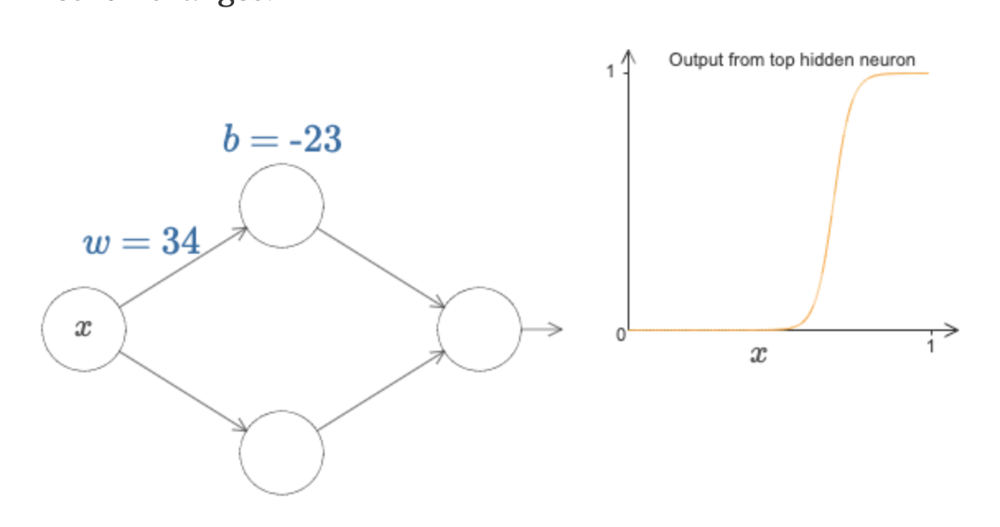
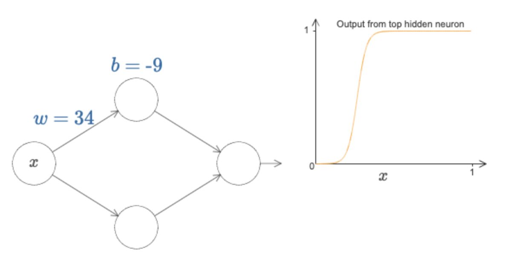
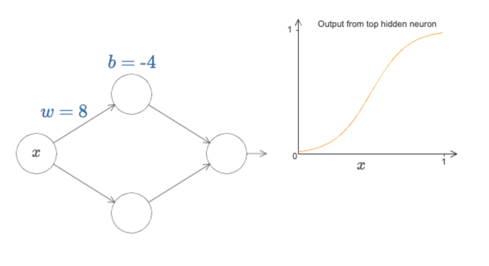
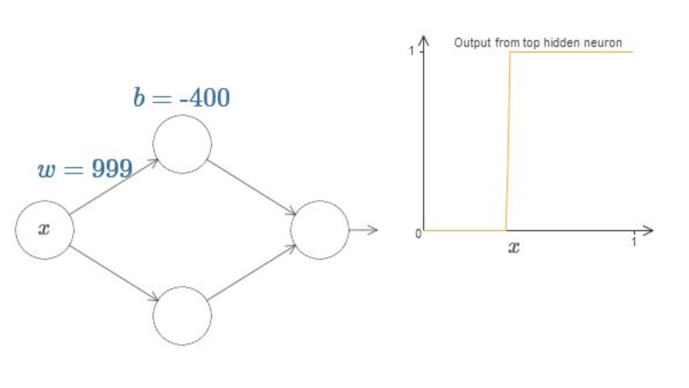
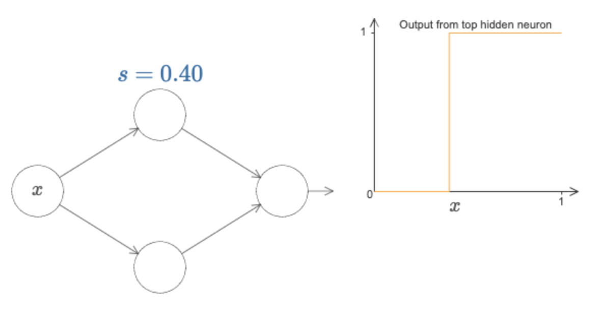
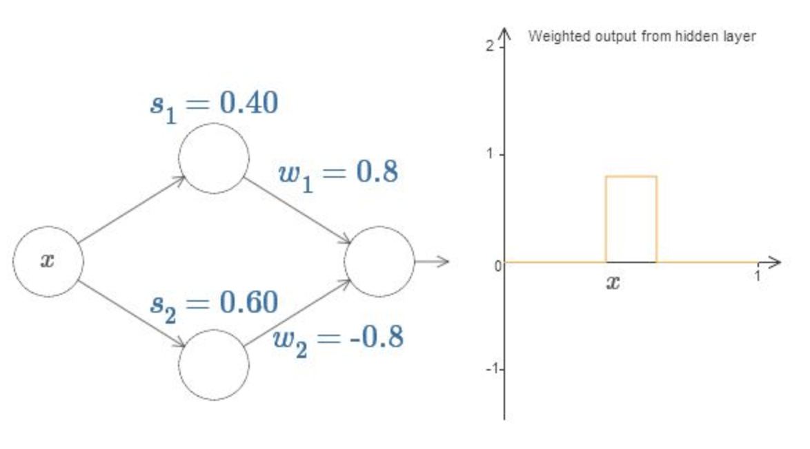
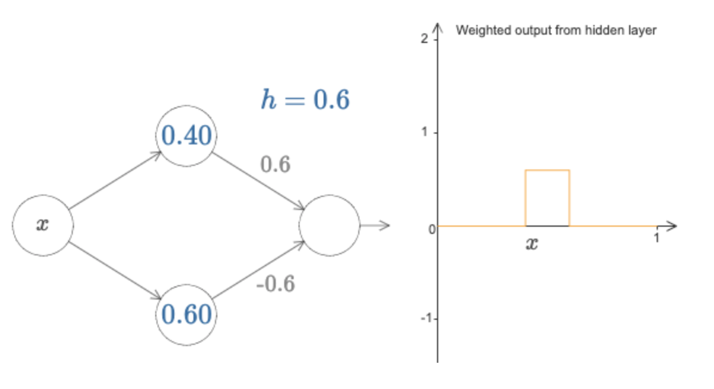
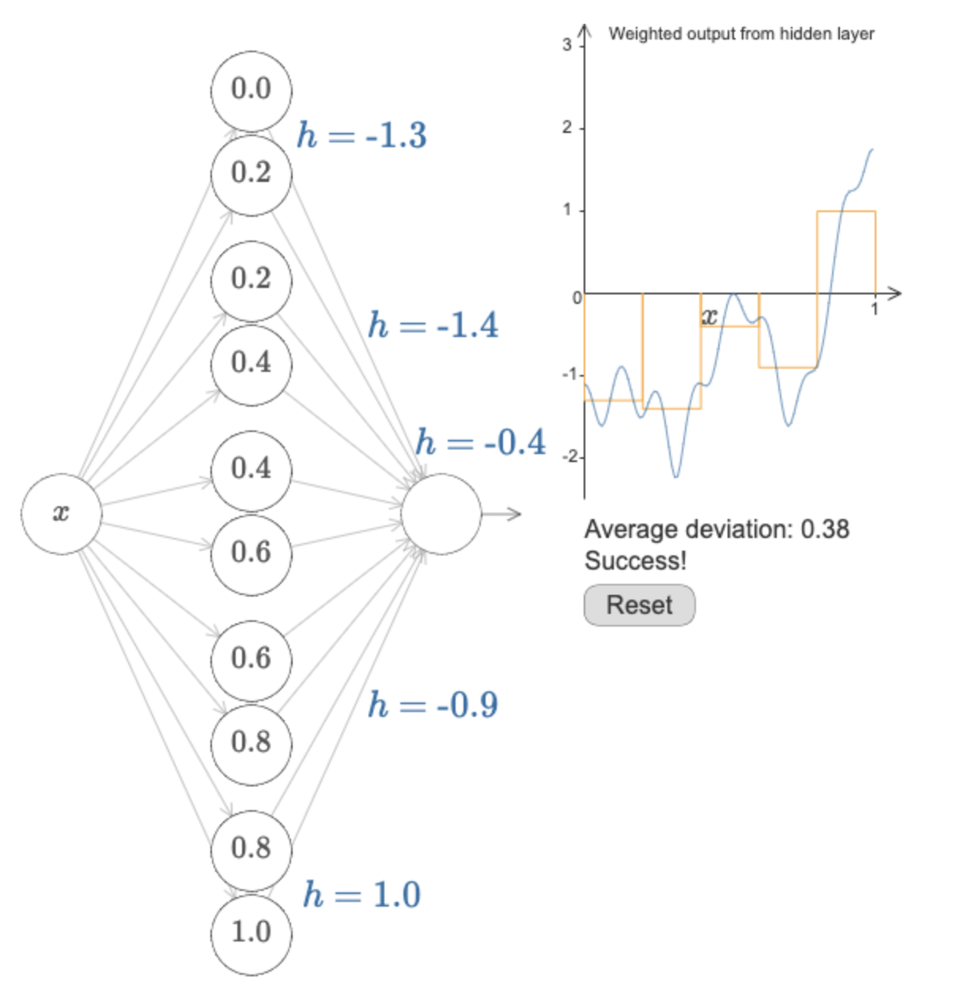

神经网络为什么有这么强大的能力呢，原因是因为**它能以任意的精度拟合任何函数**。

接下来我们通过一系列不那么严谨但是很直观的例子来说明这个问题。

#### 输入输出均为一元变量的函数

神经网络能表达任意的一元函数 y=f(x)。

先看一个最简单的神经网络部件,把下方神经元的w和b都设为0，它的图形如下图所示：

接下来，修改一下b的值，发现图形只是沿着x轴发生了平移：

而改变w的值，影响的是曲线的陡峭程度，越大越陡峭，越小越平坦

如果我们把w写成一个很大的值，发现函数图像接近于一个阶跃函数：

于是，我们只用一个参数s，表示阶跃的位置。

如果我们在0.4位置设置一个高度0.8的阶跃，在0.6位置设置一个高度-0.8的阶跃，函数图形就变成了：在0.4到0.6的位置产生了一个高度0.8的脉冲：

那我们索性再用一个参数h代替原来的(w1,w2), 表示这个脉冲的高度：

如果我们在中间层添加更多的节点，我们可以在定义域不同区间上制造连续的高度不一的脉冲，如果我们增加越来越多的中间节点，把脉冲的区间进一步缩小，就可以任意精度去贴近函数曲线了。

通过以上例子，我们说明了为什么给定足够多的中间神经元，神经网络可以以任意精度拟合任意一元函数。