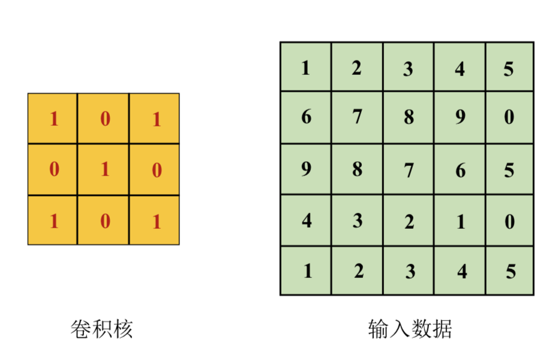
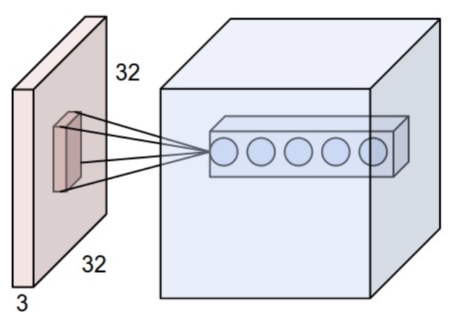
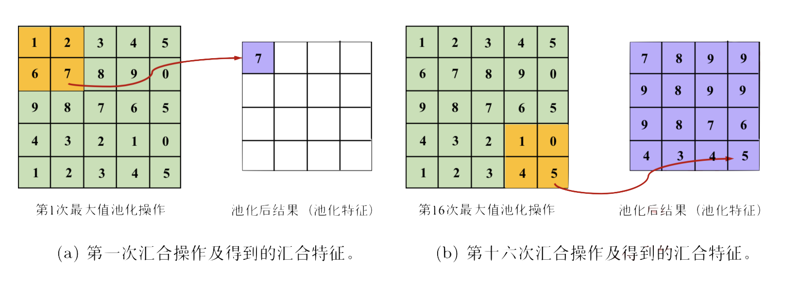
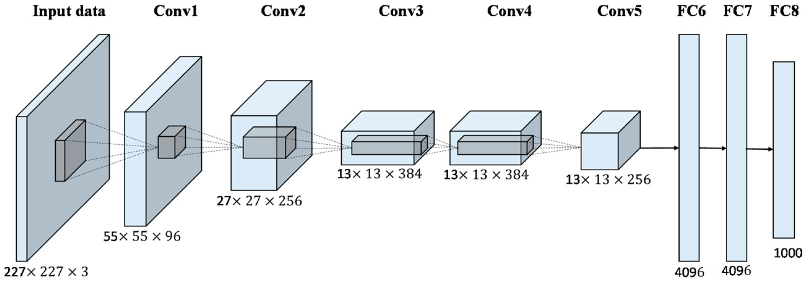
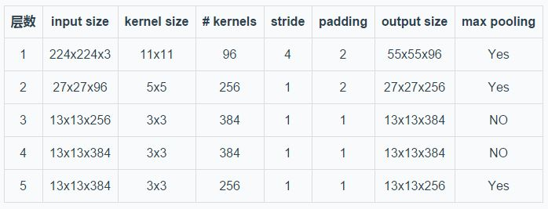
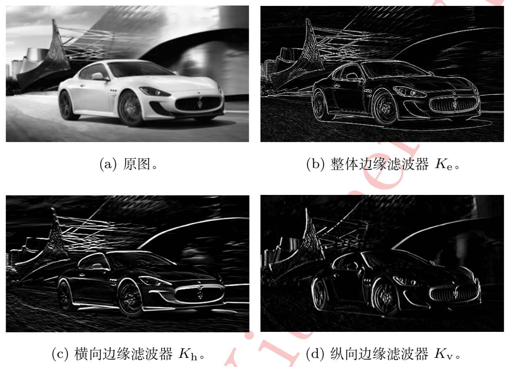
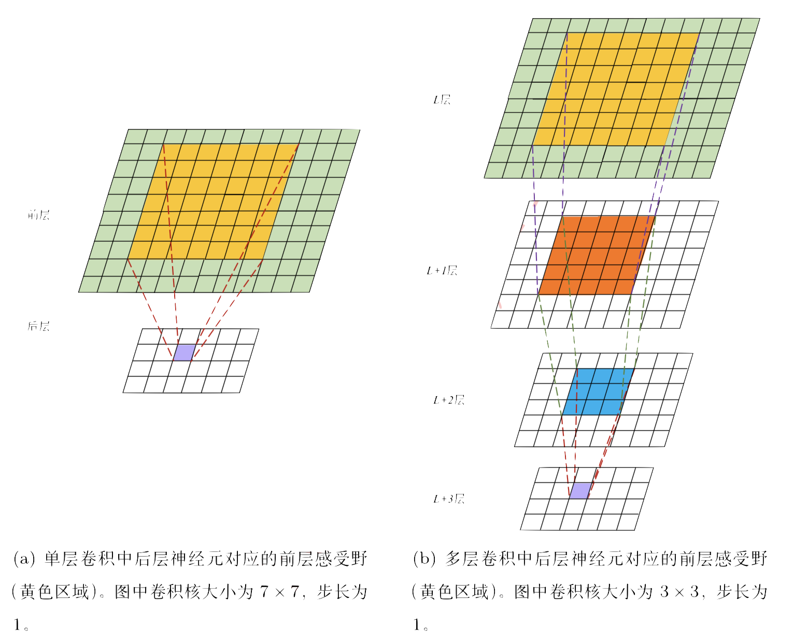
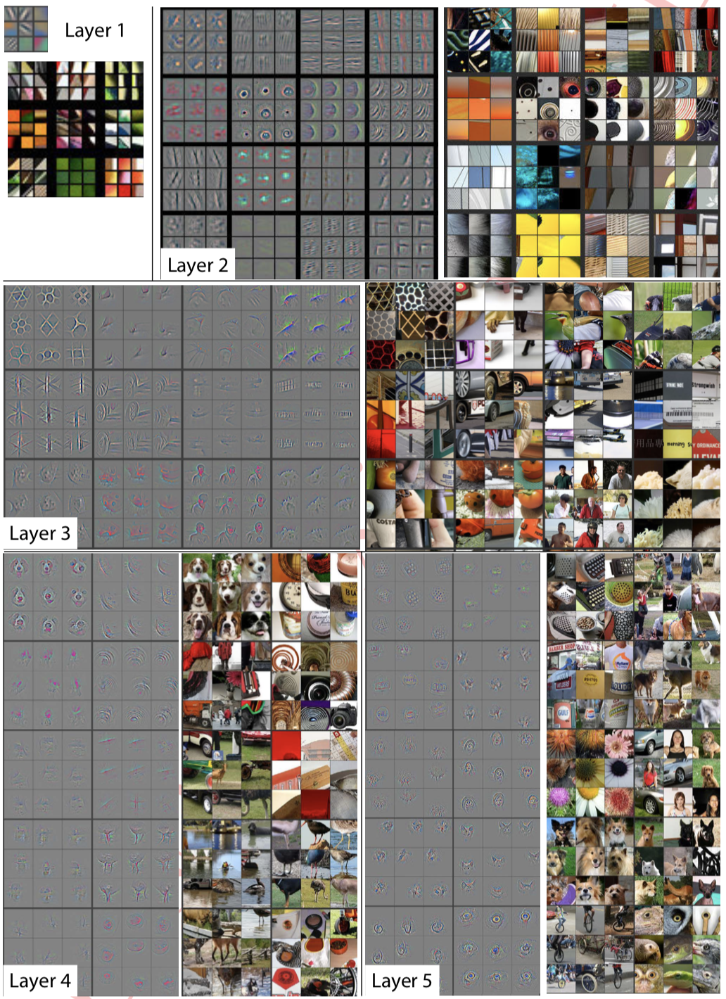
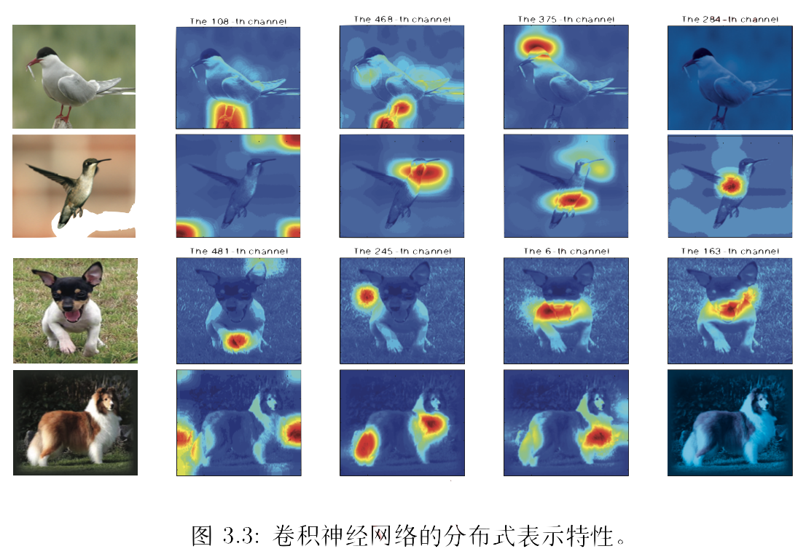

## 卷积神经网络

### 1. 是什么

一般意义下的神经网络是指全连接网络，就是说相邻两层神经元之间，两两互相连接，形成稠密的网络，例如，我们之前介绍的手写字识别的全连接网络。

我们把28*28的图的每一个像素展开，形成了一个784维的输入向量，然后通过两层网络的映射，得到最终的10种分类的结果。

直观上说，这种网络的结构，对于784个输入像素没有做任何区分，全部一视同仁的丢给隐藏层去发现他们之间的关联，进而收集到种种特征用以佐证当前图片是哪一个数字。

所以一种更擅长捕捉空间特性，且参数量更小的神经网络——**卷积神经网络**就被开发出来，并逐渐统治了计算机视觉领域。

接下来，首先介绍卷积神经网络最重要的两个组件：卷积和池化。

#### 卷积

我们保留图片原有的形状，即二维的矩阵。同时，我们定义一个N*N(例如3\*3)的小矩阵，该矩阵称为卷积核。

接下来，在图像的二维矩阵上按照特定的步长，将卷积核按照先横向再纵向的顺序扫过整个图像，并进行卷积，卷积的意思就是，把卷积核和它当前对应的图像矩阵的值进行相乘并加和，最终得到一个卷积后的矩阵，过程如下图所示：

!

很显然，卷积后得到的输出仍然是矩阵，可以继续在其上执行卷积操作。

当然，我们需要注意的是，图像一般有多通道，例如RGB。如果我们把三个通道的矩阵叠到一起，就变成了一个三维的张量, 例如图中左侧32\*32\*3的红色张量。而卷积核同样也要跟着变成一个N\*N\*3的张量，在图像的二维平面上滑动着做卷积操作。

上图就是5个N\*N\*3的卷积核在依次经过卷积操作后，将原始图像卷成了Width\*Width\*5的张量。所以，下一次卷积核的尺寸应当为N2\*N2\* 5。也就是说，虽说卷积核是三维的，卷积操作也是三维的，但是我们限制了“通道”维度的自由，使得卷积核只在长和宽上移动（当然，这只是典型的卷积网络的做法）。

#### 池化

池化（也叫汇合）操作比较简单，一般有均值池化、最大值池化等，例如，2*2大小，步长1的最大值池化操作示例如下：

#### 全连接层

经过多层的卷积、池化操作后，将最后一层池化层的输出展开，变成一个向量，并用全连接层进行分类。

#### 完整网络结构

以经典的AlexNet为例，网络结构如下：

图中Conv是卷积层，FC是全连接层。（池化层没有明确画出来）

每层卷积的输入、输出和参数规模：

### 2. 为什么

**2.1 为什么要引入卷积**

我们可以清楚地看到，卷积操作是一种作用于图片局部信息的操作，即，每个卷积核只关注一小片区域的信息（例如3\*3，或者5\*5）。每一类卷积核，处理一类通用的特征提取任务。

举个例子，如果一个卷积核的值是:
$$
\begin{bmatrix}
	0 && -4 && 0 \\
	-4 && 16 && -4\\
	0  && -4 && 0
\end{bmatrix}
$$

那么，这个卷积核将很擅长找到边缘像素。因为，如果在大片同样颜色的区域，某一个点周围的值都是相同的，那么它们的值在经过上面的卷积后，将变为0。而，如果在边缘区域，经过上述卷积后，将很大概率不为0。

同样的原因，形如：
$$
\begin{bmatrix}
	1 && -2 && 1 \\
	0 && 0 && 0\\
	1  && 2 && 1
\end{bmatrix}
$$
的卷积核擅长找横向边缘，而形如：
$$
\begin{bmatrix}
	1 && 0 && 1 \\
	-2 && 0 && 2\\
	1  && 0 && 1
\end{bmatrix}
$$
的卷积核擅长找纵向边缘。

上图就是一张图片经过上述三种卷积核处理后得到的图片内容，可以明显看出它们的差异。

在漫长（相对于计算机科学短暂的发展历程而言）的时间里，视觉算法专家们都在尝试手工设计各式各样的滤波器（卷积核）来提取各式各样的特征。而现今的卷积神经网络，更多是利用强大的学习能力自发地找到了能提取各种特征的卷积核，并且体现出了比专家们手工设计的卷积核强大很多的能力。换句话说，海量的数据告诉了CNN网络，应该怎么去合理的设计这些卷积核，才能用它们从低层到高层，从细节到抽象，一步一步的学习出各式各样可以区分世间万物的各式各样的卷积核。

卷积核的概念，很大程度地受到了认知神经科学的“感受野”概念的启发。感受野是指在视觉神经系统中，特定神经元只会响应视网膜部分区域光感受器的刺激信号。实际上，卷积核也同样如此，某一个卷积核在同一时间只会关注于当前二维图像的部分区域。起到的效果就是，下层的每一个神经元只接受上层部分区域内神经元的输出信号：

例如，左图7\*7的卷积核使得后层神经元的感受野被限制在了对应大小的前层区域内。

同时，我们需要指出的一点是，如果我们用多层小卷积核，例如3\*3尺寸，代替单层的大卷积核，在经历过几层堆叠后，能够同样将感受野扩大至相等大小的区域。而且，多层小卷积核相比单层大卷积核几个好处：

（1）能够从局部特征经过组合得到抽象特征

（2）要实现同样大小的感受野，需要的参数量更小：7\*7=49, 3\*3\*3=27

局部、泛化到抽象、整体的特征提取过程已经是计算机视觉，乃至整个深度学习领域的共识。

2014年，Zeiler和Fergus在它们的工作中，利用反卷积技术对卷积神经网络的特征进行了可视化，洞察了包括特征层次性在内的一系列卷积网络的特性。它们分析了CNN各层所学到的特征，发现浅层大多是纹理、边缘等泛化的特征，而越高的层次，就包含越多和语义、物体相关的整体特征，例如轮子、动物脸部、文字等等：

**2.2 池化层的作用**

（1）空间不变性（平移和翻转）。例如，我们的池化操作是在2\*2的范围内取最大值，那么，这个最大值出现在第一、第二、第三、第四个位置将会产生同样的输出；也就是说微小的平移或者翻转，经过池化处理后，将变得不再重要。这也就带来了一定的泛化的作用。

（2）降采样。很明显，经过池化后二维平面的像素会降低，也就带来了一定的计算量和参数量的降低。

**2.3** **分布式表示** 

另外一个重要的特性，叫分布式表示，这其实是现今深度学习各个领域——NLP、视觉、音频等共同研究的热点。我们以前会大量使用独热编码来表示各种概念，例如，如果我们现在只想表示猫和狗两种动物，可以表示为[1,0]和[0,1]，即第一个维度是猫，第二个维度为狗。而分布式表示的思路类似于，我们测量一张图片里某个物体的三种属性：脸圆程度、掌垫、鼻子大小，如果一张图片是[0.9, 0.1,0.1]，那么它就是一只猫，如果一张图片是[0.4,0.8,0.6]，那么它就是一只狗……

显然，我们举的例子过于简单了，但是表达的意思就是，一种物体、概念，由很多个维度的值共同决定，而这个维度的数量，一般在深度学习中是几百到几千维不等（例如最后一层卷积层的卷积核的个数），也就是说，**网络中同时激活的神经元组成的模式，代表了某一个现实世界中的物体或概念。**

例如，下图就是多个卷积核对于不同物体的激活情况，每一列对应着同一个卷积核，可以看到它们对不同的图片的激活区域都不相同。而多个卷积核的同时激活，以及激活程度，最后组合起来形成一个对应的概念。

