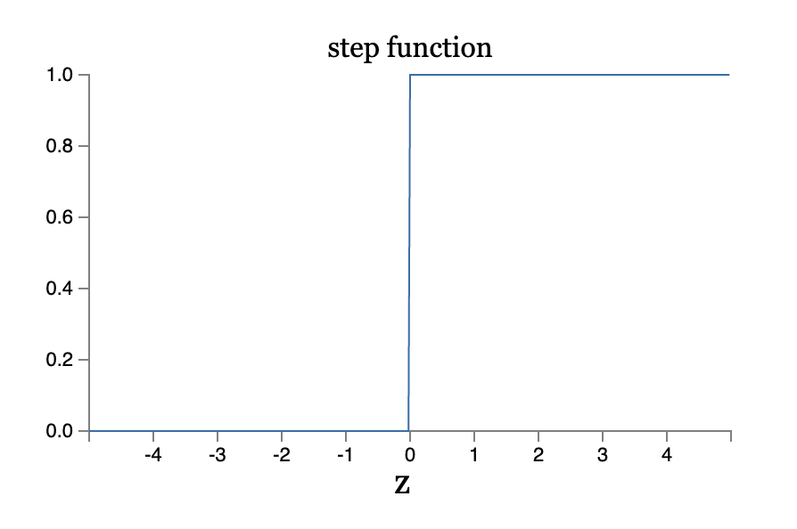

### 背景

​		人类可以很轻松地识别各种各样手写的数字，但是这种看似可以轻易完成的任务，很长时间以来，对于机器来说却很难做的很好。一开始，人们尝试去制定各种各样的规则，让机器根据这些规则来进行数字的匹配，比如，数字9的规则就是：有一个类似于圆形的东西，圆形的右边有个拖出来的尾巴。但是，这种方法容易遇到很多的问题：尾巴是不是弯曲，弯曲到什么程度……这还只是手写数字，如果是让区分一只猫和狗，这些规则更是无从定起。

​	（深度）神经网络做的事情，就是通过不断调整网络中的参数，使得它所代表的函数不断修正，直至该函数能够尽量正确地映射训练集中的样本，从而学习出一种从输入X（图片）到输出y（数字编号）的映射函数f。

​		实际上，深度神经网络，首先是神经网络，只是层次更深。为什么更深的网络效果更好，学术界给出了一些假设：

（1）层层处理

（2）内置特征变换

（3）模型复杂度够

​		更高的模型复杂度通常意味着更容易过拟合，深度学习对于这个问题的解决方法是大规模数据集和预训练。

​		为什么在90年代的时候没有出现很深的网络结构？算力只是一方面，实际上无法解决深层网络梯度消失的问题才是根本问题，梯度消失像一个幽灵不断出现，网络训练不下去！而这些都在2006年以后通过各种各样的trick、结构上的改进获得了很大程度的解决，才有了深度学习的大发展。

​		那我们先介绍神经网络。

### 感知机

神经网络的源头，是一个叫感知机的简单模型：

输入是[x1, x2, x3], 左侧的线的权重分别是[w1, w2, w3],  那么输出output由如下的函数表示：
$$
output=
\left\{
	\begin{array}{**lr**}
	0,  if \sum{w_ix_i}\leq threshold\\
	1,  if \sum{w_ix_i}\gt threshold
	\end{array}
\right.
$$
举个例子，如果我们相用一个自动化的决策模型决定是否去一个音乐节；输入x1, x2, x3分别对应着天气、女朋友是否去、交通是否方便。x1=1表示天气很好，x1=0表示天气不好；x2=1表示女朋友去，x2=0表示不去；x3=1表示交通很便利，x3=0表示交通不便。而output=1表示去，output=0表示不去。

假设对于你来说，决定性的因素是天气情况，而女朋友是否去、交通是否便利并不会产生比较大的影响，那么可以使w1=6, w2=2, w3 = 2, threshold = 5，那么，只要x1=1，那么output一定等于1，而跟x2, x3的取值无关。

另一种情况，如果w1=6, w2=2, w3 = 2, threshold = 3，那么，只要x1=1，或者x2=1，x3=1，那么output=1；也就是说，1. 天气很好，会去 2. 天气不好，但是女朋友想去并且交通很便利，也会去。

所以，同样的一个模型结构，只要调整模型中的参数(w)，就会获得不同的决策模型。从直觉上，该模型可以理解为，收集多方面的证据$(x_i)$，按照重要性$(w_i)$进行分配合并$(\sum)$, 并根据合并的结果作出决策。

从仿生学角度来说，感知机就仿佛神经元一样，输入突触收集其他神经元发送过来的电信号，按照它们之间连接强弱进行加权求和，并根据自身的阈值决定是否要通过输出突触发送一个脉冲信号。当然，感知机要比真正的神经元工作方式简化不少。

下面的模型是一个多层感知机的例子，它从输入开始，层层处理上一层神经元的输出，并得到最终的输出。

当然，我们一般使用感知机的另一种等价的形式：
$$
output=
\left\{
	\begin{array}{**lr**}
	0,  if \vec{w} \cdot \vec{x}+b\leq 0\\
	1,  if \vec{w} \cdot \vec{x}+b\gt 0
	\end{array}
\right.
$$
即，把输入和权重用向量表示，乘积求和用向量内积来表示，threshold移到式子左边（-b=threshold）。

那么，我们如何确定网络中的参数呢？

一种做法，我们希望通过不断调整网络中的w和b来使得网络的输出越来越接近想要的那样。而且，最好，小的调整 $\Delta w, \Delta b$  使得网络输出的变化也是一个很小的量$\Delta output$。但是，感知机的输出是一个阶跃的过程，微小的改动，可能就会使得输出从0跳到1，或者从1跳到0，它不是一个连续的过程。

如果多层感知机的中间节点突然从0跳到1，那么网络的输出可能就会产生比较大而复杂的变化。所以，我们希望引入一个变化更加“**平滑**”的函数来取代感知机的阶跃函数，从而达到渐进调整的目的。这就是sigmoid激活函数被引入的原因。

### Sigmoid

网络结构上，使用sigmoid激活函数的神经元和感知机并无区别，但是在输出前，它对$\vec w \cdot \vec x+b$上施加了不同的映射：
$$
output = \sigma(\vec w \cdot \vec x+b)\\
其中, \sigma(z) = \frac{1}{1+e^{-z}}
$$
下面两张图是sigmoid和阶跃函数的对比：

可以看到，他们的值域分别是{0,1}集合和(0,1)区间，sigmoid在整个定义域上是连续的，因此，可以不断调整参数，使得输出不断小步接近想要的结果；而阶跃函数在0附近是非连续的，会发生突变。sigmoid的输出还可以理解为output=0和output=1的概率，比如，我们想要知道当前图片是不是数字9，那么output>0.5的时候，是9，output<=0.5的时候，不是9。

小步调整可以表示为：$\Delta output \approx\sum\frac{\partial output}{\partial w_i}\Delta w_i + \frac{\partial output}{\partial b}\Delta b $

再次总结一下，sigmoid激活函数的目的是，**使得output在整个定义域上连续（可微）**。

### 手写数字识别

好，介绍完sigmoid激活函数之后，我们看一个简单的用于数字分类的网络结构：

该网络由三层构成——input、hidden、output，input层768节点，对应图像的像素（28*28），hidden层15个节点，output层10个sigmoid节点，对应10个阿拉伯数字，激活程度最高的节点对应的数字，就是模型判断当前图片所对应的数字。

如何从直觉上理解，这个网络是怎样认出数字“0”的呢？

我们先看一张手写的0:

假设有一个中间层的节点（不妨设是第一个节点），试图收集左上角的证据:

调节该局部图形对应的一系列输入节点和中间层第一个节点的连接权重，把其他输入节点和中间层第一个节点的连接权重设为0，那么，该中间节点的激活就表示找到了上图这样的局部图形。

同样的，其他部分也分别由中间层的第二、三、四个节点负责收集证据：

那么，输出层的第一个节点（对应数字0）把中间层第一、二、三、四个节点的证据（激活强度）继续整合，并根据获得的证据决定自己的激活强度，就得到了当前图片是数字0的概率。

所以，很大程度上，神经网络可以理解为一种记忆模型，它会记住丢过来的训练数据的样子，把自己调整成符合训练数据输入输出对应关系的函数形式。

但是，我们经常说的泛化能力又是从何而来呢？泛化能力就是总结已有样例，并推广到更一般情况的能力。比如，每个人写的0多多少少都有点区别，如果一个人字写的很怪，不合常规，我们虽然觉得不好看，但是还是能轻松地认出来，但是如果一个模型没有泛化能力，那么它将无法认出除了训练数据以外的0（大一点，歪一点，长一点，圆一点）。

事实上，人们花了大量的时间优化模型的泛化性能，在视觉任务上，通过

1. 引入更大规模的数据集（例如imagenet），来覆盖更多的情况
2. 引入较强的模型结构先验假设（例如CNN），对模型的函数空间做规约，并具备跟任务类型相匹配的性质（CNN中的平移不变性、旋转不变性等等）

视觉以外的其他任务，也在走类似的路线。在我看来，**先验结构，数据规模（类型），优化技巧**，是推动深度学习不断向前的三驾马车。

继续回到本篇文章的主题。那么，既然神经网络是通过神经元之间权重的调整来获得“收集证据”的能力，那我们如何设置合理的权重呢？这就要说到**梯度下降法**和**BP算法**了。

### 梯度下降法

梯度这个词，具有很强的隐喻。假设我们现在的目标是爬到山顶，那么我们一定会大致沿着**山坡朝上倾斜的方向**行走，逐渐往上。

**梯度下降**，顾名思义，就是把目标反过来——我们要走到谷底，那么自然也就需要沿着**山坡朝下倾斜的方向**行走了。

如果我们把一个函数——例如C=f(v1,v2)——的图形想象成一个山：

那么，求极小值，就是“走到”这个山的谷底。

先对C=f(v1,v2)在$(v1_0, v2_0)$处做泰勒展开：$C=f(v1_0, v2_0)+(v1-v1_0)f'_{v1}(v1_0,v2_0)+(v2-v2_0)f'_{v2}(v1_0,v2_0)$ +……

如果$v1和v1_0$足够接近，那么一阶近似就足够精确。：

$C \approx f(v1_0, v2_0)+(v1-v1_0)f'_{v1}(v1_0,v2_0)+(v2-v2_0)f'_{v2}(v1_0,v2_0)$

我们现在希望，C在(v1,v2)处的值比$(v1_0, v2_0)$处更小，那么，只要使得:

$(v1-v1_0)=-\eta f'_{v1}(v1_0, v2_0)$

$(v2-v2_0)=-\eta f'_{v2}(v1_0, v2_0)$  即可

其中，$\eta >0$，用来控制变量变化的步长

所以，$v1 = v1_0-\eta f'_{v1}(v1_0, v2_0)$, $v2 = v2_0-\eta f'_{v2}(v1_0, v2_0)$

这就是梯度下降的本质：按照负导数$-f'$指向的方向，根据一个比较小的步长$\eta$更新变量，函数值就会相应变小。

实际上，一般我们会把$v1,v2$写为向量形式$\vec v=(v1,v2)^T$, 而把其梯度写为 $\nabla f_v=( f'_{v1}(v1_0, v2_0), f'_{v2}(v1_0, v2_0))^T$, 更新步骤写为：

$\vec v \leftarrow \vec v-\eta \nabla f_v$

接下来，我们要给手写识别任务设定一个衡量**识别误差的目标函数**$C(\vec w, \vec b, X, Y)$，其中X、Y是训练集，是不可动的部分，所以我们的目的是通过调整参数$\vec w, \vec b$使**$C$ —— 误差**不断“下降”。

##### 手写任务目标函数

假设训练集中，一个图片样本 **x** 对应的数字为6，那么我们用向量$ (0,0,0,0,0,0,1,0,0,0)^T$来表示它的标签**$\hat y$**

我们应该给将要训练的神经网络设立一个什么样的目标呢？

这个目标可以是: 图像输入$x$经过神经网络之后，输出的结果y应该和$\hat y$ **尽量接近**。

我们先naive一下，用y和$\hat y$ 的平方欧式距离来度量他们的接近程度： $||y-\hat y||^2$

那么，$C=\frac{1}{2n}\sum_x||\hat y(x)-y(x)||^2$ 

$y(x) = f(\vec w,\vec b, x)$，$\hat y(x)和x$ 是已经给定的量，我们需要用梯度下降法来调整$\vec w, \vec b$， 使得$C$不断下降。

迭代公式为：
$$
\vec w_{t+1} \leftarrow \vec w_t-\eta \nabla_w C\\
\vec b_{t+1} \leftarrow \vec b_t-\eta \nabla_b C
$$
那么，问题就变成了，如何去求解网络中所有w、b的梯度。

