1. 语音识别问题

   给定声学特征 $ \textbf{Y}_{1:T}=\textbf{y}_1, ..., \textbf{y}_T $

   找到最有可能生成 $\textbf{Y}$ 的词序列 $\textbf{w}_{1:L} = \textbf{w}_1,...,\textbf{w}_L$ .

   i.e.   $ \hat{\textbf{w}}=\underset{\textbf{w}}{argmax}\{P(\textbf{w}|\textbf{Y})\} $ 

   根据贝叶斯定理，上式等价于:

   $ \hat{\textbf{w}}=\underset{\textbf{w}}{argmax}\{P(\textbf{Y}|\textbf{w})P(\textbf{w})\}   $

   其中包含了两部分：声学模型 $ P(\textbf{Y}|\textbf{w}) $ ， 和语言模型 $ P(\textbf{w}) $

2. 架构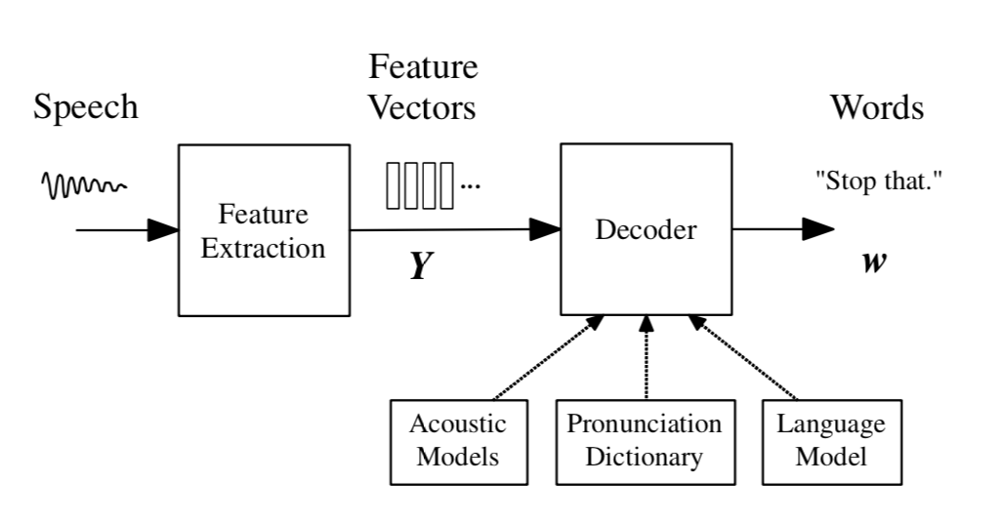

3. 声学模型 

   q:  单词的一种发声

   Q：单词序列的一种发声

   $ Q: q^{w}_{1:K_w} = q_1,...,q_{K_w} $

   展开：

   $ P(\textbf{Y}|\textbf{w}) = \sum_{Q}^{}P(\textbf{Y}|\textbf{Q})P(\textbf{Q}|\textbf{w})$

   $ P(\textbf{Q}|\textbf{w}) = \prod_{l=1}^{L}P(\textbf{q}^{(w_l)}|w_l)$

   音素（q）级别hmm：

   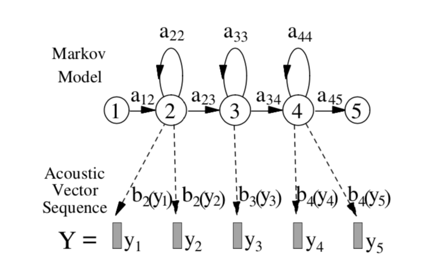

   观测概率b()一般用GMM建模

   **训练目标（含隐变量的极大似然估计）：**

   估计音素子状态间转移概率矩阵A，及各个音素子状态对应的GMM（B）参数值。

   **训练过程（EM算法）：**

   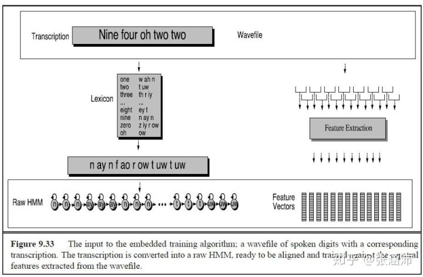

   初始状态下，以flat start的方式给定模型的初始值，即：$A_{i,i} = 0.5, A_{i,i+1}=0.5$

   $ B = \sum_{i=0,n}\pi_i\mathcal N(\textbf{0},\textbf{I}), \pi_i = \frac{1}{n} $ 

   **E步：**

   用当前的参数值计算对齐概率(前向后向算法)：

   $ γ^{(rj)} = P(θ_t = s_j|Y ^{(r)};λ) = α^{(rj)}β^{(rj)} $

   **M步：**

   用对齐概率重新估计参数值

   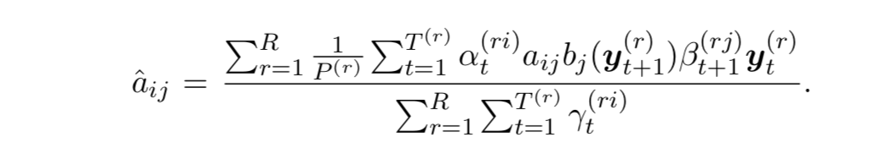

   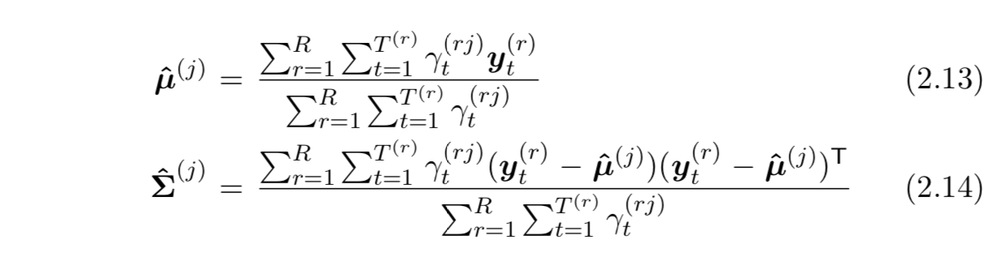

   反复执行EM步直至收敛或者达到最大迭代次数。

   * 注：在实际应用中，为了迭代更快，通常用强制对齐，即用Viterbi算法在E步选出最优的对齐方式，而不是给出以概率形式表示的软对齐。 

4. 解码

   目标：根据声学特征序列，找出N-best 词序列，用lattice描述

   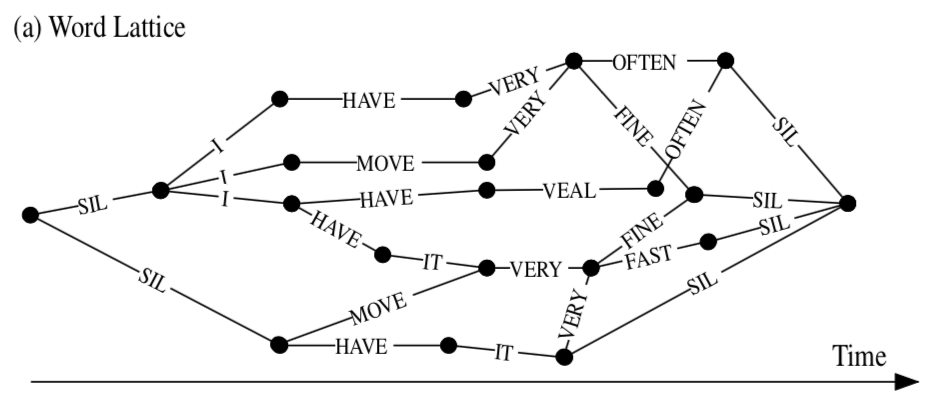

   解码过程：WFST路径搜索。

   搜索图生成：		𝐻∘𝐶∘𝐿∘𝐺

   L: 发音词典 

   G:语言模型

   C: 声学上下文 

   H:声学模型state 

   以𝐿∘𝐺为例：

   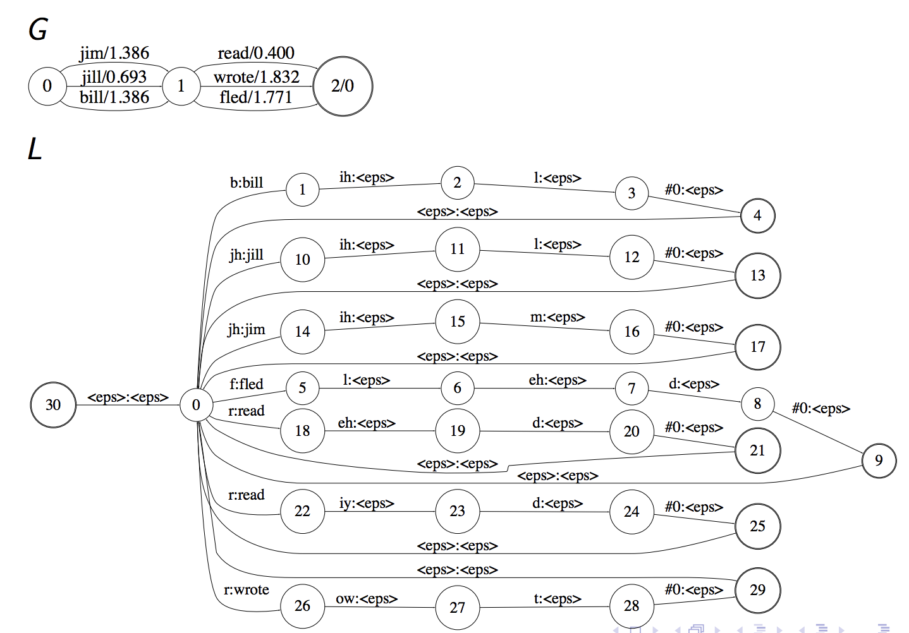

   展开后：

   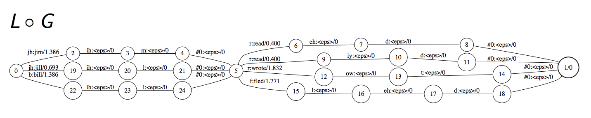

   当然，一般还会对图进行确定化和最小化操作:

   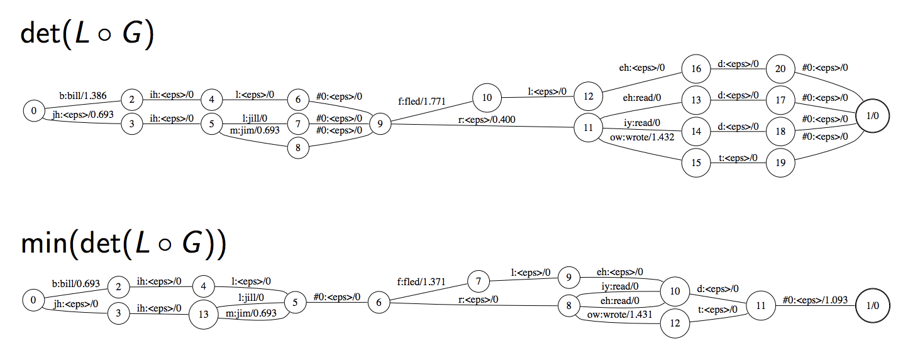

   最终的  $ HCLG = min(det(H ◦ min(det(C ◦ min(det(L ◦ G)))))) $

   

   搜索过程：

   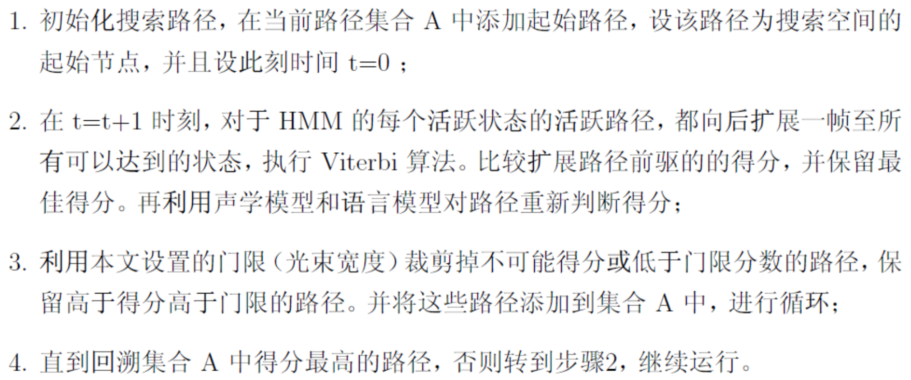

   宽度优先 (beam剪枝)

   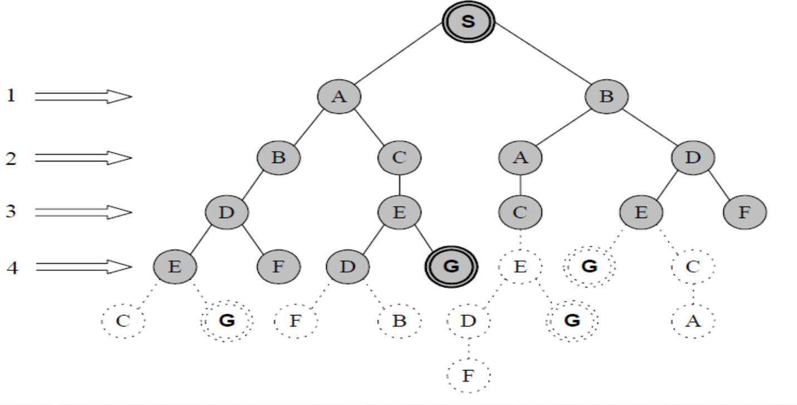

   代码：

   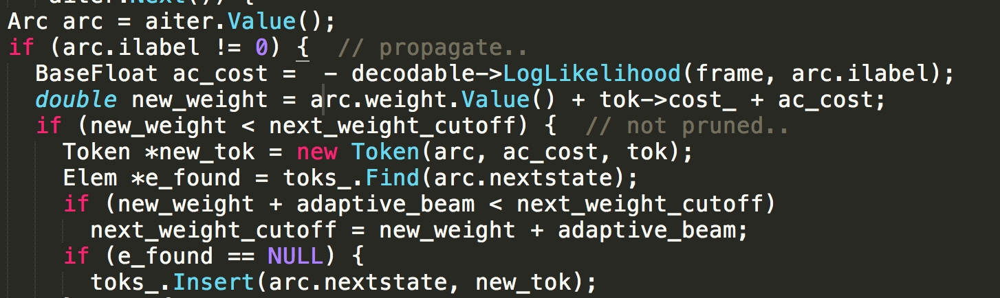

