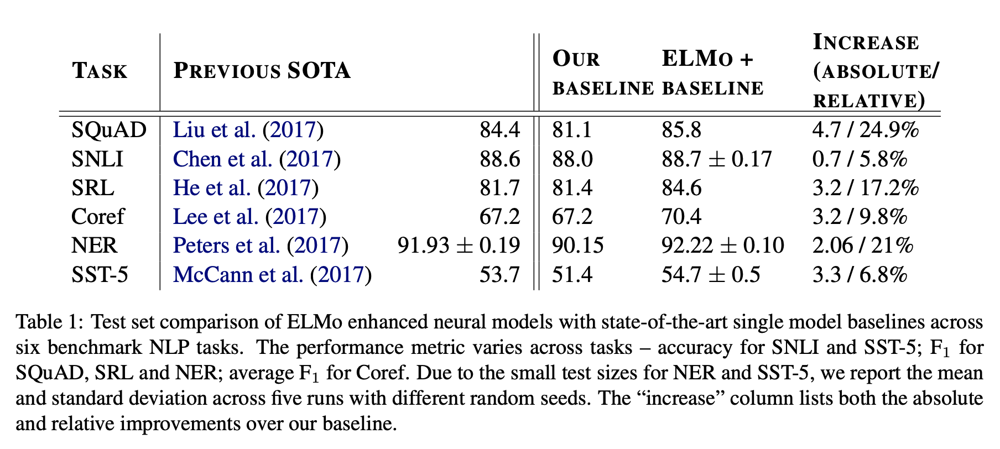

上文提到了，以word2vec为代表的词嵌入模型，以**低维、稠密、实值**的方式实现了词的向量化表示，一定程度上解决了词级别的维度爆炸、稀疏、无相关性的问题。

但是，进一步思考又会发现新的问题：

**（1）歧义的问题如何解决**

比如，猫是动物，也是一种通信设备：

"把我的猫重启一下"

"帮我的猫洗个澡"

这两句话中的"猫”显然不是一个意思。但是word2vec却只会给出一个表示。

一种方法，用更细粒度的"义原"来表达。义原会把词进一步拆分，直到精确地表示词的含义。

然而，这种做法，工作量之浩大可想而知。

而且，人们是不会用义原来沟通的，意味着新产生的数据都将是词级别，而不是义原级别的。

**另一种方法，ELMO类模型，包括2018下半年强势刷榜的BERT。**

他们的输出，一般称为contextual word vectors，即包含了上下文环境的词向量。

ELMO的思路很简单，然而却是NLP表示学习浓墨重彩的一笔。

它认为，单词的表示应该跟上下文信息有关，是自身及上下文的一个函数表示，Vt = f(context, Wt)。

那么，如果我们用双向的循环神经网络来表示这个函数，那么，先从左至右编码句子直到单词Wt，这时候编码的状态是Ht->，再从右至左编码句子直到单词Wt，后向编码的状态是<-Ht。最后把他们合到一起，就是单词Wt在当前上下文中的表示[Ht->, <-Ht]。

这个网络怎么训练呢？前向和后向网络分别用语言模型，即根据Ht-1->预测Wt， 和根据<-Ht+1预测Wt来训练，这样，我们只需要有很多文本语料，不需要有任何人工产生的标注就能完成ELMO的训练。

elmo在所有任务上均刷新了当时的最好成绩（后面被BERT再次刷新，但是论idea的原创性的话，elmo才是爸爸），表明了其作为**通用表示模型**的强大能力。它也因此被评选为NAACL2018最佳论文。

**关于上下文使用的区别**

看起来，word2vec好像也使用了上下文，为什么会有区别呢？

简单的理解，例如"苹果”这个单词在两种上下文里出现，一种表示水果，一种表示手机。对于word2vec来说，“苹果”的向量会被两种上下文拉来拉去，直到找到一个根据两种上下文在训练语料中出现的频率平衡的位置，训练好之后，就不会有变化。而对于ELMO来说，它会根据当前我们正在编码的句子，对“苹果”这个词的原始向量动态“注入”上下文的信息，从而对两种“苹果”的语义进行了区分。

**（2）如何利用深度学习层层抽象的能力？**

ELMO的另一个洞见，是多层双向循环神经网络的隐藏状态，代表了不同抽象层面的信息：

高层网络的状态编码了上下文相关的语义信息 (例如，它们适合于语义消歧之类的任务)， 而低层网络的状态编码了句法相关的信息 (比如，它们适合用来做词性标注之类的任务)。

这个又一次佐证了概念的层次性假设：概念逐层向上，抽象程度越来越高，高层概念由低层概念组合而成。就如同视觉任务曾经观察到的一样：网络逐层捕获物体的构成——从细节到全局，从部分到整体。

